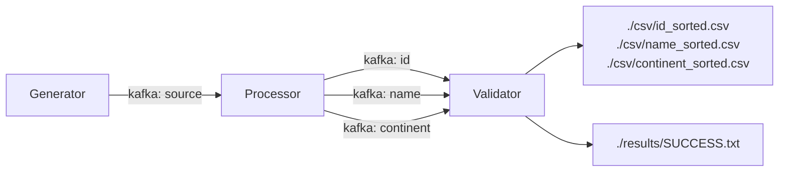
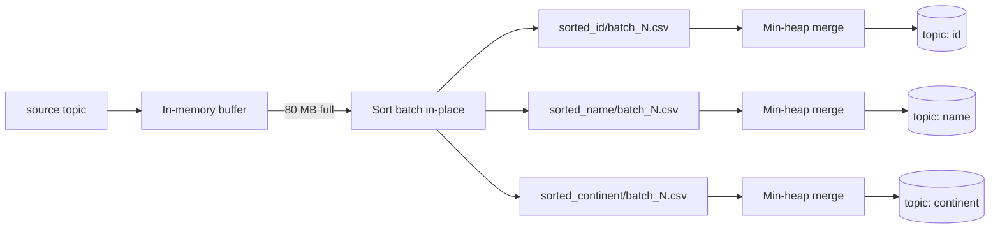

# Core Infra — Data Pipeline

## Overview

A high-throughput data pipeline that generates, sorts, and validates 50 million CSV records using three Go services
coordinated through Kafka (KRaft mode — no ZooKeeper).

| Component     | Role                                                                                              |
|---------------|---------------------------------------------------------------------------------------------------|
| **Generator** | Produces 50M random events → Kafka topic `source`                                                 |
| **Processor** | Consumes `source`, external-sorts by `id`, `name`, `continent` → topics `id`, `name`, `continent` |
| **Validator** | Consumes output topics → writes `./csv/*.csv` and `./results/`                                    |



---

## Prerequisites

- Docker ≥ 20.10 and Docker Compose v2
- `make` (optional — all commands also work without it)
- **Architecture:** prebuilt images are `linux/amd64`. Apple Silicon / arm64 users
  must [build locally](#4-building-images-locally).

---

## Quickstart (Recommended)

```sh
git clone <repo-url> core-infra && cd core-infra
make run
```

`make run` starts all containers in the background, streams logs sequentially (generator → processor → validator), and
prints total wall-clock time when the pipeline finishes.

- **Linux / macOS:** runs `scripts/run.sh`
- **Windows:** runs `scripts/run.ps1` via PowerShell

---

## 1. Pull Prebuilt Images

Pre-pulling is optional but speeds up first run:

```sh
docker pull udhayarajan/core-infra-generator:latest
docker pull udhayarajan/core-infra-processor:latest
docker pull udhayarajan/core-infra-validator:latest
docker pull apache/kafka:latest
```

---

## 2. Run with Docker Compose

This is the simplest fully-automated path. It handles networking, health checks, resource limits, and volume mounts.

```sh
# Pull and start everything (images are pulled automatically if not present)
docker compose up -d

# Stream logs per service
docker compose logs -f generator
docker compose logs -f processor
docker compose logs -f validator

# Stop and clean up
docker compose down --volumes --remove-orphans
```

Or use `make run` which wraps the above and reports total runtime.

---

## 3. Run Manually with `docker run`

Use this when you want direct control over each container.

### Step 1 — Create the network

```sh
docker network create core-infra
```

### Step 2 — Start Kafka broker

```sh
docker run -d --name broker --hostname broker \
  --memory=256m --cpus=1 \
  --network core-infra \
  -p 9092:9092 \
  -e KAFKA_NODE_ID=1 \
  -e KAFKA_PROCESS_ROLES='broker,controller' \
  -e KAFKA_CONTROLLER_QUORUM_VOTERS='1@broker:29093' \
  -e KAFKA_LISTENERS='PLAINTEXT://broker:29092,CONTROLLER://broker:29093,PLAINTEXT_HOST://0.0.0.0:9092' \
  -e KAFKA_ADVERTISED_LISTENERS='PLAINTEXT://broker:29092,PLAINTEXT_HOST://localhost:9092' \
  -e KAFKA_LISTENER_SECURITY_PROTOCOL_MAP='PLAINTEXT:PLAINTEXT,PLAINTEXT_HOST:PLAINTEXT,CONTROLLER:PLAINTEXT' \
  -e KAFKA_INTER_BROKER_LISTENER_NAME='PLAINTEXT' \
  -e KAFKA_CONTROLLER_LISTENER_NAMES='CONTROLLER' \
  -e KAFKA_LOG_DIRS='/tmp/kraft-combined-logs' \
  -e KAFKA_HEAP_OPTS='-Xms128m -Xmx128m' \
  -e KAFKA_OFFSETS_TOPIC_REPLICATION_FACTOR=1 \
  -e KAFKA_MESSAGE_MAX_BYTES=10485760 \
  -e KAFKA_REPLICA_FETCH_MAX_BYTES=10485760 \
  apache/kafka:latest
```

Wait until the broker is healthy before continuing:

```sh
# Poll until output is "healthy"
docker inspect --format='{{json .State.Health.Status}}' broker

# Or watch startup logs directly
docker logs -f broker
```

### Step 3 — Start Generator, Processor, Validator

```sh
# Generator — produces 50M events to topic: source
docker run -d --name generator \
  --memory=128m --cpus=1 \
  --network core-infra \
  -e KAFKA_BROKER=broker:29092 \
  udhayarajan/core-infra-generator:latest -max=50_000_000

# Processor — consumes source, sorts, publishes to id/name/continent
docker run -d --name processor \
  --memory=1536m --cpus=1 \
  --network core-infra \
  -e KAFKA_BROKER=broker:29092 \
  udhayarajan/core-infra-processor:latest -max=50_000_000 -batch=100_000_000

# Validator — writes sorted CSV to host ./csv/ and ./results/
mkdir -p csv results
docker run -d --name validator \
  --memory=128m --cpus=1 \
  --network core-infra \
  -v ${PWD}/csv:/csv \
  -v ${PWD}/results:/results \
  -e KAFKA_BROKER=broker:29092 \
  udhayarajan/core-infra-validator:latest
```

> **Windows PowerShell:** replace `${PWD}` with an absolute path, e.g. `C:\Users\you\core-infra`. Ensure `csv\` and
`results\` exist first.

### Step 4 — Follow logs and wait for completion

```sh
docker logs -f generator
docker logs -f processor
docker logs -f validator
```

### Step 5 — Clean up

```sh
docker stop generator processor validator broker
docker rm generator processor validator broker
docker network rm core-infra
```

---

## 4. Building Images Locally

Required when:

- Host is arm64 / Apple Silicon
- Source code has been modified

```sh
# Build all images using Docker Compose
make build
# equivalent to: docker compose build

# Or build individually
docker build -t core-infra-generator:local -f generator/Dockerfile .
docker build -t core-infra-processor:local -f processor/Dockerfile .
docker build -t core-infra-validator:local -f validator/Dockerfile .
```

---

## 5. Resource Budget (2 GB RAM, 4 CPUs)

The pipeline is designed to stay within the 2 GB / 4 CPU constraint. Here is the breakdown:

| Service      | `mem_limit`  | `cpu_count` | Notes                                                                   |
|--------------|--------------|-------------|-------------------------------------------------------------------------|
| Kafka broker | 256 MB       | 1           | JVM heap pinned to 128 MB via `KAFKA_HEAP_OPTS=-Xms128m -Xmx128m`       |
| Generator    | 128 MB       | 1           | Pure CPU — generates and publishes; no large buffers                    |
| Processor    | 1536 MB      | 1           | Largest consumer: holds one 80 MB batch in memory plus k-way merge heap |
| Validator    | 128 MB       | 1           | Streams one record at a time; no in-memory accumulation                 |
| **Total**    | **~2048 MB** | **4**       | Fits within budget                                                      |

**Key tuning decisions:**

- Kafka JVM heap is fixed at 128 MB (`-Xms128m -Xmx128m`) to prevent unbounded JVM growth.
- Single partition per topic eliminates replication overhead and reduces broker memory.
- Processor's `-batch=80_000_000` (80 MB) controls the peak in-memory sort buffer. The k-way merge after that holds only
  one record per batch file in a min-heap, so memory stays flat during the merge phase.
- Unnecessary Kafka background threads (`num.network.threads`, `num.io.threads`, `background.threads`) are reduced to 1
  each to lower idle memory and CPU overhead.
- Log cleaner is disabled (`KAFKA_LOG_CLEANER_ENABLE=false`) since topics are write-once and compaction is not needed.

---

## 6. Architecture and Algorithm

### Data schema

```
id (int32), name (string, 10–15 chars), address (string, 15–20 chars), continent (string)
```

Example row: `21,axxxxxxxxx,12 abc dfsf LdUE,Asia`

### Data flow

```
Generator
  └─► Kafka topic: source  (50M raw events)
        └─► Processor (Stage 1: batch sort)
              ├─► sorted_id/batch_N.csv
              ├─► sorted_name/batch_N.csv
              └─► sorted_continent/batch_N.csv
        └─► Processor (Stage 2: k-way merge)
              ├─► Kafka topic: id
              ├─► Kafka topic: name
              └─► Kafka topic: continent
                    └─► Validator
                          ├─► ./csv/id_sorted.csv
                          ├─► ./csv/name_sorted.csv
                          ├─► ./csv/continent_sorted.csv
                          └─► ./results/SUCCESS.txt
```

### Generator

- Detects available CPU cores and spawns one goroutine per core for parallel event generation.
- Each goroutine produces a share of the 50M events with random `id`, `name`, `address`, and `continent` values.
- All events are published to the `source` Kafka topic with batching enabled.

### Processor — two-stage external sort

Processing 50M records at once would require more memory than the budget allows, so the processor uses **external merge
sort**:

**Stage 1 — Batch sort:**

- Consumes events from `source` and accumulates them in an in-memory buffer.
- When the buffer reaches `-batch` bytes (80 MB), it is sorted in-place by `id`, `name`, and `continent` and written to
  disk as `sorted_<key>/batch_N.csv`.
- A `-flush` timeout (default 10 s) ensures the last partial batch is always flushed.

**Stage 2 — K-way merge:**

- After all batches are written, a min-heap (one entry per batch file) merges all sorted batch files for each sort key
  into a single globally sorted stream.
- Only one record per batch file is held in memory at a time, so peak heap usage is `O(number_of_batches)`, not
  `O(total_records)`.
- The merged stream is published to the corresponding Kafka topic (`id`, `name`, or `continent`).



**Why this design?**
External sort is the standard approach for datasets that exceed available RAM. The k-way merge guarantees globally
sorted output while keeping memory usage proportional to the number of batch files (tens to low hundreds), not the total
record count.

### Validator

- Reads from topics `id`, `name`, `continent` concurrently.
- Streams each record directly to the corresponding CSV file — no in-memory accumulation.
- After all records are written, prints sample records and total counts per file, then writes a summary to
  `./results/SUCCESS.txt`.
- summary syntax is [head|mid|tail] path=<filepath> line=<id>,<name>,<address>,<continent>

### Startup order

Docker Compose enforces startup order via `depends_on: condition: service_healthy`. The generator, processor, and
validator all wait for the broker's healthcheck to pass before starting.

For manual `docker run`, follow: broker → generator → processor → validator.

---

## 7. Verifying Correctness

After the pipeline completes, run these checks from the project root.

### 7a. Line counts (expect 50,000,000 per file)

```sh
# Linux / macOS
wc -l csv/id_sorted.csv csv/name_sorted.csv csv/continent_sorted.csv

# Windows PowerShell
(Get-Content csv\id_sorted.csv).Count
(Get-Content csv\name_sorted.csv).Count
(Get-Content csv\continent_sorted.csv).Count
```

Expected output:

```
 50000000 csv/id_sorted.csv
 50000000 csv/name_sorted.csv
 50000000 csv/continent_sorted.csv
```

### 7b. Inspect first and last records

```sh
# id.csv — smallest id should be first, largest last
head -n 3 csv/id_sorted.csv
tail -n 3 csv/id_sorted.csv

# name.csv — alphabetically earliest name first
head -n 3 csv/name_sorted.csv
tail -n 3 csv/name_sorted.csv

# continent.csv — "Africa" records should appear before "Asia", etc.
head -n 3 csv/continent_sorted.csv
tail -n 3 csv/continent_sorted.csv
```

### 7c. Verify sort order (no out-of-order lines)

```sh
# id.csv: check that the id column (field 1) never decreases
awk -F',' 'NR>1 && $1+0 < prev { print "OUT OF ORDER at line " NR; exit 1 } { prev=$1+0 }' csv/id_sorted.csv \
  && echo "id.csv: sort order OK"

# name.csv: check that the name column (field 2) is non-decreasing
awk -F',' 'NR>1 && $2 < prev { print "OUT OF ORDER at line " NR; exit 1 } { prev=$2 }' csv/name_sorted.csv \
  && echo "name.csv: sort order OK"

# continent.csv: same check on field 4
awk -F',' 'NR>1 && $4 < prev { print "OUT OF ORDER at line " NR; exit 1 } { prev=$4 }' csv/continent_sorted.csv \
  && echo "continent.csv: sort order OK"
```

### 7d. Check the validator summary

```sh
cat results/SUCCESS.txt
```

This file is written by the validator at completion and contains per-topic record counts and sample records confirming
the pipeline ran end-to-end.

---

## 8. Sample Output and Runtime

Representative output on a 4-core / 2 GB host:

```
=== GENERATOR ===
generator  | {"time":"2026-04-10T07:57:21.681212739Z","level":"INFO","source":{"function":"main.main","file":"/go/src/app/generator/main.go","line":61},"msg":"Starting producer","total_messages":50000000}
generator  | {"time":"2026-04-10T08:01:20.176170648Z","level":"INFO","source":{"function":"main.main","file":"/go/src/app/generator/main.go","line":83},"msg":"pipeline complete","total":50000000,"errors":0,"success":50000000,"duration":"3m58.503472949s","throughput_msg_per_sec":209640.55274763636}
=== GENERATOR completed===

=== PROCESSOR ===
processor  | {"time":"2026-04-10T07:57:22.191324992Z","level":"INFO","source":{"function":"main.(*Subscriber).Subscribe","file":"/go/src/app/processor/main.go","line":128},"msg":"starting processor handler"}
processor  | {"time":"2026-04-10T07:57:45.946320415Z","level":"INFO","source":{"function":"core-infra/processor/batcher.(*Batcher).flushBatches.func1","file":"/go/src/app/processor/batcher/batcher.go","line":141},"msg":"flushed batch","messages":1963222}
processor  | {"time":"2026-04-10T07:57:55.596733172Z","level":"INFO","source":{"function":"core-infra/processor/batcher.(*Batcher).flushBatches.func1","file":"/go/src/app/processor/batcher/batcher.go","line":141},"msg":"flushed batch","messages":1483878}
...
processor  | {"time":"2026-04-10T08:05:23.292907132Z","level":"INFO","source":{"function":"main.main","file":"/go/src/app/processor/main.go","line":92},"msg":"doing external sort, this will take some time"}
processor  | {"time":"2026-04-10T08:05:23.293027798Z","level":"INFO","source":{"function":"core-infra/processor/sort.ExternalSort","file":"/go/src/app/processor/sort/external.go","line":37},"msg":"doing external sort","path":"csv/1775807842137940564/sorted_continent","topic":"continent"}
...
processor  | {"time":"2026-04-10T08:16:51.642309379Z","level":"INFO","source":{"function":"core-infra/processor/sort.mergeFiles","file":"/go/src/app/processor/sort/external.go","line":120},"msg":"finished external merge","topic":"name","emitted":50000000}
processor  | {"time":"2026-04-10T08:16:51.642552292Z","level":"INFO","source":{"function":"main.main","file":"/go/src/app/processor/main.go","line":97},"msg":"external sort completed","duration":"11m28.40197609s"}
=== PROCESSOR completed===

=== VALIDATOR ===
validator  | {"time":"2026-04-10T07:57:21.709379107Z","level":"INFO","source":{"function":"main.(*Subscriber).Subscribe","file":"/go/src/app/validator/main.go","line":71},"msg":"starting validator handler"}
validator  | {"time":"2026-04-10T08:17:12.22928128Z","level":"INFO","source":{"function":"core-infra/validator/handler.(*consumerGroupHandler).watchInactivity","file":"/go/src/app/validator/handler/handler.go","line":97},"msg":"validator inactivity timeout reached, shutting down"}
validator  | {"time":"2026-04-10T08:17:13.60202858Z","level":"INFO","source":{"function":"main.main","file":"/go/src/app/validator/main.go","line":51},"msg":"Done writing events to files, please check ./csv directory on host machine","duration":"19m52.136372744s","id":"./csv/id_sorted.csv","name":"./csv/name_sorted.csv","continent":"./csv/continent_sorted.csv"}
...
validator  | {"time":"2026-04-10T09:09:37.949450468Z","level":"INFO","source":{"function":"main.renderSample.func2","file":"/go/src/app/validator/main.go","line":206},"msg":"sample.summary","path":"./csv/name_sorted.csv","msg":"[tail] path=./csv/name_sorted.csv line=22967215,zzzzySktZbQPMQ,t1pBb19sfbEYvw5yET,Australia"}
...
validator  | {"time":"2026-04-10T09:09:37.953930722Z","level":"INFO","source":{"function":"main.main","file":"/go/src/app/validator/main.go","line":60},"msg":"Done printing sample, please check ./results/SUCCESS.txt on host machine"}
=== VALIDATOR completed===

Pipeline completed in 1437.2360982 seconds.
```

> Actual times will vary by host hardware. The wall-clock time is printed by `make run` / `scripts/run.sh` /
`scripts/run.ps1` at the end.

---

## 9. Bottleneck Analysis

| Stage                 | Bottleneck               | Reason                                                                |
|-----------------------|--------------------------|-----------------------------------------------------------------------|
| Generation            | Kafka produce throughput | Network and broker I/O cap how fast 50M messages can be flushed       |
| Batch sort            | Memory bandwidth         | In-place sort of a 80 MB buffer; CPU-bound but fast                   |
| K-way merge           | Disk I/O                 | Reading N batch files simultaneously; min-heap overhead is negligible |
| Kafka produce (merge) | Broker write throughput  | Same constraint as generation, but for 3× topics                      |
| Validation            | Disk write               | Sequential CSV writes; CPU is idle                                    |

The **generator → broker → processor** path is the primary bottleneck because Kafka is single-partitioned (by design, to
keep memory within budget) and all 50M messages must pass through it twice (raw → sorted).

### Scaling to more data and more machines

- **More data on one machine:** increase `-batch` if RAM allows; more batch files increase k-way merge heap size but
  stay memory-efficient.
- **Multiple machines:** partition the `source` topic across multiple brokers and processor replicas. Each processor
  handles a key-range shard; a final merge step (or a second Kafka Streams job) produces globally sorted output.
- **Object storage:** for truly large datasets, replace intermediate CSV batch files with object storage (S3 / GCS) so
  workers are stateless and horizontally scalable.

---

## 10. Cleanup

```sh
# Docker Compose
docker compose down --volumes --remove-orphans

# Manual docker run
docker stop generator processor validator broker
docker rm generator processor validator broker
docker network rm core-infra

# Remove output files
rm -rf csv/ results/
```
